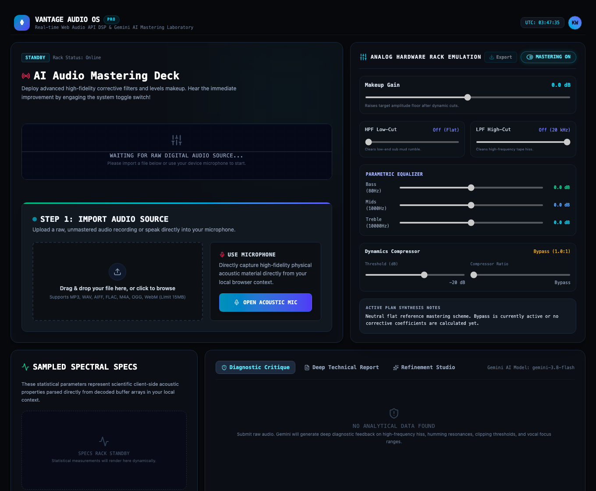
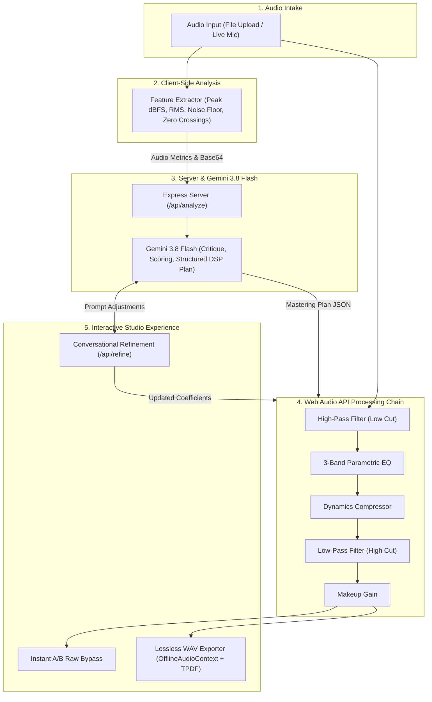

<div align="center">

# AI Audio Engineer (Vantage Audio OS)

An interactive, studio-grade audio mastering, acoustic critique, and visualization workstation combining real-time browser Web Audio DSP with Gemini 3.8 Flash acoustic intelligence.

[](https://www.typescriptlang.org/)
[](https://react.dev/)
[](https://ai.google.dev/)
[](https://tailwindcss.com/)
[](https://vitest.dev/)

[Features](#features) • [Architecture](#architecture) • [Getting Started](#getting-started) • [Audio DSP Pipeline](#audio-dsp-pipeline) • [Mastering Standards](#mastering-standards) • [Quality Checks](#quality-checks)

<br />
<br />



</div>

---

AI Audio Engineer is an end-to-end mastering workstation designed for musicians, podcasters, sound designers, and content creators. It pairs client-side mathematical feature extraction (peak amplitude, RMS loudness, zero-crossing frequency estimation, noise floor sampling, and digital clipping detection) with the reasoning capabilities of **Gemini 3.8 Flash** to diagnose acoustic defects and prescribe exact digital signal processing parameters.

Users can audition mastering adjustments in real time with an instant A/B raw bypass switch, refine DSP parameters using conversational natural language, and export broadcast-ready lossless 16-bit or 24-bit PCM WAV files with TPDF dithering and True Peak normalization.

> [!TIP]
> Get started immediately by uploading any audio file (MP3, WAV, AIFF, FLAC, M4A, OGG) or record directly from your browser microphone.

## Features

- **Multimodal Acoustic Diagnostics**: Extracts statistical signal metrics (peak dBFS, RMS loudness, noise floor, and clipping) and leverages `gemini-3.8-flash` to evaluate hiss, hum, saturation, and dynamic stability.
- **Automated Critique & Quality Scoring**: Rates overall recording quality on a 0–100 scale, highlights priority flaws, and generates an in-depth technical mastering report.
- **5-Stage Web Audio DSP Rack**: Provides a tactile, hardware-emulated console featuring high-pass filtering, 3-band parametric EQ, dynamics compression, low-pass hiss filtering, and makeup gain.
- **Instant A/B Raw Bypass**: Seamlessly audition processed audio against original raw input during active playback without audio glitching or dropouts.
- **Conversational Plan Refinement**: Chat directly with the AI engineer to alter mastering goals (e.g. *"tame acoustic hiss"*, *"add warm tube bass"*, *"studio radio vocals"*) and instantly recalculate DSP coefficients.
- **Broadcast-Grade Lossless WAV Export**: Offline client-side rendering with True Peak normalization (-1.0 dBFS streaming / -0.1 dBFS CD), selectable 16-bit or 24-bit PCM, and TPDF dither.
- **Live Oscilloscope & Spectrum Canvas**: High-refresh time-domain waveform display and frequency spectrum visualizer powered by `AnalyserNode`.

## Architecture



### Technology Stack

| Layer | Technologies |
| --- | --- |
| **Frontend Framework** | [React 19](https://react.dev/), [TypeScript](https://www.typescriptlang.org/), [Vite 8](https://vite.dev/) |
| **Styling & Icons** | [Tailwind CSS v4](https://tailwindcss.com/), [Lucide React](https://lucide.dev/), [Motion](https://motion.dev/) |
| **Audio Processing** | Web Audio API (`AudioContext`, `OfflineAudioContext`, `BiquadFilterNode`, `DynamicsCompressorNode`, `GainNode`, `AnalyserNode`) |
| **AI & LLM Services** | [`@google/genai`](https://www.npmjs.com/package/@google/genai) SDK with Google Gemini 3.8 Flash (`gemini-3.8-flash`) |
| **Schema Validation** | [Zod](https://zod.dev/) runtime validation on client and server boundaries |
| **Backend API** | [Express 5](https://expressjs.com/) with Vite dev middleware / production static file serving |
| **Tooling & Tests** | [Biome](https://biomejs.dev/) (linting and formatting), [Vitest](https://vitest.dev/) (unit and integration tests) |

## Getting Started

### Prerequisites

- **Node.js**: Version 20.0.0 or higher.
- **Google Gemini API Key**: Obtain a key from [Google AI Studio](https://aistudio.google.com/).

### Installation

1. **Clone the repository**:
   ```bash
   git clone https://github.com/kweinmeister/ai-audio-engineer-app.git
   cd ai-audio-engineer-app
   ```

2. **Install dependencies**:
   ```bash
   npm install
   ```

3. **Configure environment variables**:
   Create a `.env.local` file in the project root:
   ```bash
   cp .env.example .env.local
   ```
   Set your API key in `.env.local`:
   ```env
   GEMINI_API_KEY="your_gemini_api_key_here"
   # Optional: customize model (defaults to gemini-3.8-flash)
   # GEMINI_MODEL="gemini-3.8-flash"
   ```

   > [!NOTE]
   > When deployed inside Google AI Studio, `GEMINI_API_KEY` and `APP_URL` are injected automatically into the runtime container.

4. **Start the development server**:
   ```bash
   npm run dev
   ```
   Open your browser at `http://localhost:3000`.

## Audio DSP Pipeline

The audio mastering engine routes signal linearly through seven distinct Web Audio processing nodes to eliminate acoustic flaws before shaping tonal balance and leveling dynamics:

```mermaid
graph LR
    Source[AudioBufferSourceNode] --> HPF[High-Pass Filter]
    HPF --> Bass[Bass Peaking EQ]
    Bass --> Mid[Mid Peaking EQ]
    Mid --> Treble[Treble Peaking EQ]
    Treble --> Comp[Dynamics Compressor]
    Comp --> LPF[Low-Pass Filter]
    LPF --> Gain[Output Gain Node]
    Gain --> Analyser[AnalyserNode]
    Analyser --> Dest[AudioDestinationNode]
```



| Stage | Node Type | Target Range | Acoustic Function |
| --- | --- | --- | --- |
| **1. High-Pass Filter** | `BiquadFilterNode` (`highpass`) | 0 – 500 Hz | Cuts subsonic rumble, microphone handling noise, and low plosives |
| **2. Low Shelf / Bass EQ** | `BiquadFilterNode` (`peaking`) | 80 Hz (±18 dB) | Controls body, weight, and low-frequency warmth |
| **3. Midrange EQ** | `BiquadFilterNode` (`peaking`) | 1,000 Hz (±18 dB) | Sculpts vocal intelligibility, boxiness, and presence |
| **4. High Shelf / Treble EQ** | `BiquadFilterNode` (`peaking`) | 10,000 Hz (±18 dB) | Imparts acoustic sheen, clarity, and top-end air |
| **5. Dynamics Compressor** | `DynamicsCompressorNode` | -60 to 0 dBFS (1:1 to 20:1) | Tames unruly peaks and stabilizes volume consistency |
| **6. Low-Pass Filter** | `BiquadFilterNode` (`lowpass`) | 1,000 – 22,000 Hz | Filters out ultrasonic interference, electrical hiss, and digital noise |
| **7. Makeup Gain** | `GainNode` | -24 to +24 dB | Elevates master signal to meet target platform loudness standards |

## Mastering Standards

The diagnostic engine and export presets adhere to international audio engineering specifications:

| Platform / Standard | Target Loudness | True Peak Ceiling | High-Pass Recommendation |
| --- | --- | --- | --- |
| **Streaming Music** (Spotify, Apple Music, YouTube) | -14.0 LUFS | -1.0 dBFS | 20–35 Hz |
| **Podcasts & Spoken Word** (AES TD1004 / Apple Podcasts) | -16.0 LUFS (stereo) / -19.0 LUFS (mono) | -1.0 dBFS | 60–100 Hz |
| **Broadcast Delivery** (EBU R128) | -23.0 LUFS | -1.0 dBFS | 30–40 Hz |
| **CD Audio Mastering** (Red Book PCM) | Free / Unconstrained | -0.1 dBFS | 20 Hz |

## API Endpoints

### `GET /api/config`
Retrieves the active server runtime configuration, including the configured Gemini model identifier.

**Response Payload**
```json
{
  "model": "gemini-3.8-flash"
}
```

### `POST /api/analyze`
Submits extracted client-side features along with optional base64 audio data for acoustic diagnosis, scoring, and DSP parameter generation.

**Request Payload**
```json
{
  "features": {
    "fileName": "vocal_track.wav",
    "fileSize": 1048576,
    "duration": 24.5,
    "sampleRate": 44100,
    "maxVolumeDb": -1.2,
    "avgVolumeDb": -18.4,
    "estimatedNoiseFloorDb": -58.2,
    "clippingDetected": false,
    "frequencyPeaks": [120, 1000, 4500, 8000],
    "mimeType": "audio/wav"
  },
  "base64Audio": "<base64-encoded-audio>",
  "mimeType": "audio/wav"
}
```

**Response Payload**
Returns a validated JSON object with `score` (0–100), `critique` breakdown (hiss, hum, clipping, dynamics, room), `masteringPlan` DSP parameters, `reportMarkdown`, and the `model` identifier used.

### `POST /api/refine`
Adjusts the active mastering plan using conversational natural language instructions.

**Request Payload**
```json
{
  "currentPlan": { ... },
  "userFeedback": "Reduce the treble hiss and make the bass warmer",
  "critique": { ... }
}
```

**Response Payload**
Returns updated `masteringPlan` DSP parameters and refined explanation.

## Quality Checks & Scripts

| Script | Command | Purpose |
| --- | --- | --- |
| **Dev Server** | `npm run dev` | Starts Express server with Vite middleware on port 3000 |
| **Build Bundle** | `npm run build` | Compiles client assets (`vite build`) and server bundle (`esbuild`) into `dist/` |
| **Production Start** | `npm start` | Executes production compiled server (`node dist/server.cjs`) |
| **Lint & Format Check** | `npm run lint` | Runs Biome linter and formatter validation (`--error-on-warnings`) |
| **Auto-Format** | `npm run format` | Applies Biome safe fixes and formatting across all codebase files |
| **Type Check** | `npm run typecheck` | Validates TypeScript types across frontend and backend (`tsc --noEmit`) |
| **Run Tests** | `npm test` | Runs the full Vitest suite (121 passing tests across 16 test files) |
| **Watch Tests** | `npm run test:watch` | Runs Vitest in interactive watch mode |
